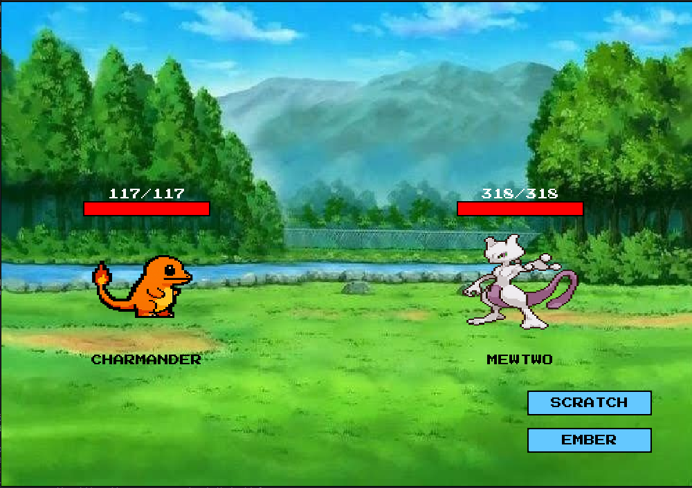

## 1. Descripción General

Pokeminmax es un simulador de combates Pokémon que implementa inteligencia artificial a través del algoritmo Minimax con poda alfa-beta. El proyecto permite a los usuarios seleccionar su propio Pokémon y enfrentarse a un oponente controlado por la IA en un sistema de combate por turnos inspirado en los juegos originales de Pokémon.

## 2. Estructura del Proyecto

```
pokeminimax-ia/
├── main.py             # Punto de entrada principal con menú de selección
├── requirements.txt    # Dependencias del proyecto
├── setup_minimax.py    # Script para inicializar estructura de proyecto
├── data/               # Datos, imágenes y recursos
│   ├── pokemon.csv     # Base de datos de Pokémon disponibles
│   ├── fonts/          # Fuentes tipográficas
│   └── images/         # Imágenes de Pokémon y elementos de UI
├── game/               # Lógica de juego y motor
│   ├── __init__.py     
│   ├── battle.py       # Sistema de combate
│   ├── minimax.py      # Implementación del algoritmo Minimax
│   ├── player.py       # Clases de jugadores (humano e IA)
│   └── pokemon.py      # Modelos de datos y efectividades
└── ui/                 # Interfaces de usuario
    ├── __init__.py
    └── graphic_ui.py   # Interfaz gráfica con Pygame
```

## 3. Componentes Principales

### 3.1 Motor del Juego (game)

#### 3.1.1 Sistema de Pokémon (pokemon.py)
- **Estructuras de datos**: Define clases `Pokemon` y `Attack` usando dataclasses.
- **Tipos de Pokémon**: Utiliza tipos literales para representar los 16 tipos de la primera generación.
- **Tabla de Efectividad**: Implementa la tabla de efectividad de tipos de Pokémon como un diccionario anidado.
- **Cargador de Pokémon**: La clase `PokemonLoader` carga los datos desde el archivo CSV y las imágenes asociadas.
- **Cálculo de Daño**: Función `calculate_damage()` que aplica fórmulas de efectividad.

#### 3.1.2 Sistema de Combate (battle.py)
- **Estado de la Batalla**: Clase `BattleState` que mantiene el estado del juego.
- **Sistema de Batalla**: Clase `BattleSystem` que orquesta los turnos y ataques.
- **Turnos**: Maneja la alternancia de turnos entre jugador e IA.
- **Condiciones de Victoria**: Detecta cuando un Pokémon se debilita (HP <= 0).

#### 3.1.3 Jugadores (player.py)
- **Clase Base**: `Player` como clase abstracta que define la interfaz.
- **Jugador Humano**: Implementación `HumanPlayer` para entrada de usuario.
- **Jugador IA**: Implementación `AIPlayer` que utiliza el algoritmo Minimax.

#### 3.1.4 Algoritmo Minimax (minimax.py)
- **Función de Evaluación**: Evalúa un estado de combate basado en la diferencia de PS.
- **Minimax con Poda**: Implementación del algoritmo Minimax con poda alfa-beta.
- **Profundidad Configurable**: Configurable mediante `MAX_DEPTH` (por defecto 2).
- **Decisión de Movimiento**: Función `minimax_decision()` que selecciona el mejor ataque.

### 3.2 Interfaces de Usuario (ui)

#### 3.2.1 Interfaz Gráfica (graphic_ui.py)
- **Motor Gráfico**: Utiliza Pygame para renderizar el combate.
- **Selector de Pokémon**: Implementa un carrusel visual para seleccionar Pokémon.
- **Animaciones**: Efectos visuales como la animación de la barra de vida.
- **Controles**: Interacción mediante clics para seleccionar ataques.

## 4. Flujo del Juego

1. **Inicio**: El usuario ejecuta main.py y selecciona el modo de juego.
2. **Selección de Pokémon**: 
   - En la interfaz gráfica: Utiliza el carrusel para seleccionar Pokémon.
3. **Combate**:
   - Los jugadores y la IA se alternan en turnos para atacar.
   - En cada turno, se selecciona un ataque y se calcula el daño.
   - La vida del oponente se reduce en función del daño.
4. **Victoria/Derrota**: El juego termina cuando uno de los Pokémon se debilita (HP <= 0).

## 5. Detalles Técnicos

### 5.1 Implementación del Algoritmo Minimax

El algoritmo Minimax con poda alfa-beta es una técnica de IA para juegos de suma cero, implementado en minimax.py:

- **Función de Evaluación**: Utiliza la diferencia de PS como heurística.
- **Nodos Terminales**: Estados donde un Pokémon está debilitado o se alcanza la profundidad máxima.
- **Maximización/Minimización**: La IA maximiza (sus PS - PS del oponente), mientras que el jugador minimiza.
- **Poda alfa-beta**: Optimización para evitar explorar ramas subóptimas.

El proceso de decisión:
1. Para cada ataque posible, simula su resultado
2. Evalúa el nuevo estado recursivamente con Minimax
3. Selecciona el ataque que produce el mayor valor de evaluación

### 5.2 Sistema de Efectividad de Tipos

El sistema replica la mecánica de Pokémon donde ciertos tipos son efectivos contra otros:

- **Multiplicadores**: 2.0 (super efectivo), 1.0 (normal), 0.5 (poco efectivo), 0 (inmune)
- **Tipos Múltiples**: Si un Pokémon tiene dos tipos, se multiplican las efectividades.

### 5.3 Carga de Recursos

- **Pokémon**: Se cargan desde un archivo CSV (pokemon.csv).
- **Imágenes**: Las imágenes se cargan dinámicamente desde la carpeta images.
- **Fuentes**: Se utilizan fuentes pixeladas para la interfaz gráfica.

## 6. Cómo Ejecutar el Proyecto

### 6.1 Requisitos

Los requisitos principales del proyecto son:

- **colorama**: Permite imprimir texto coloreado en la terminal, mejorando la experiencia en la interfaz de consola.
- **typing-extensions**: Proporciona compatibilidad con nuevas características de tipado para versiones antiguas de Python.
- **pygame**: Biblioteca para desarrollar videojuegos en Python, utilizada para la interfaz gráfica del simulador.

### 6.2 Instalación

```bash
# Clonar el repositorio
git clone <URL-del-repositorio>

# Instalar dependencias
pip install -r requirements.txt
```

### 6.3 Ejecución

```bash
# Ejecutar el juego
python main.py
```

### 6.4 Modo de Juego

- **Modo Gráfico**: Interfaz con Pygame (recomendado para mejor experiencia).

## 7. Ejemplo de Uso

### 7.1 Modo Gráfico

<div style="display: flex; justify-content: center; align-items: center; gap: 12px;">
  
</div>

El modo gráfico ofrece:
- Carrusel de selección visual de Pokémon
- Animaciones de batalla
- Interfaz intuitiva para seleccionar ataques
- Barras de vida con animaciones
- Mensajes de estado visual

## 8. Limitaciones y Posibles Mejoras

- **Variedad de Pokémon**: Actualmente solo se incluyen 15 Pokémon de la primera generación.
- **Complejidad de la IA**: La profundidad del Minimax es limitada para mantener el rendimiento.
- **Animaciones**: Las animaciones de ataques podrían mejorar para mayor inmersión.
- **Estados de Pokémon**: No se incluyen estados alterados como envenenamiento o parálisis.

## 9. Créditos y Licencia

El proyecto está bajo la Licencia MIT. Desarrollado por:
- Joseph David Herrera Libreros
- Juan David Cuéllar López
- Samuel Escobar Rivera
- César David Peñaranda Melo

---
